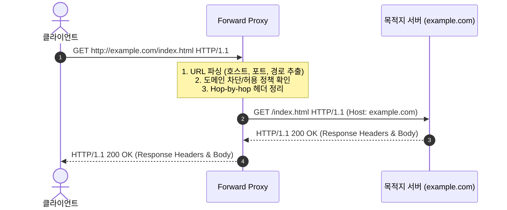
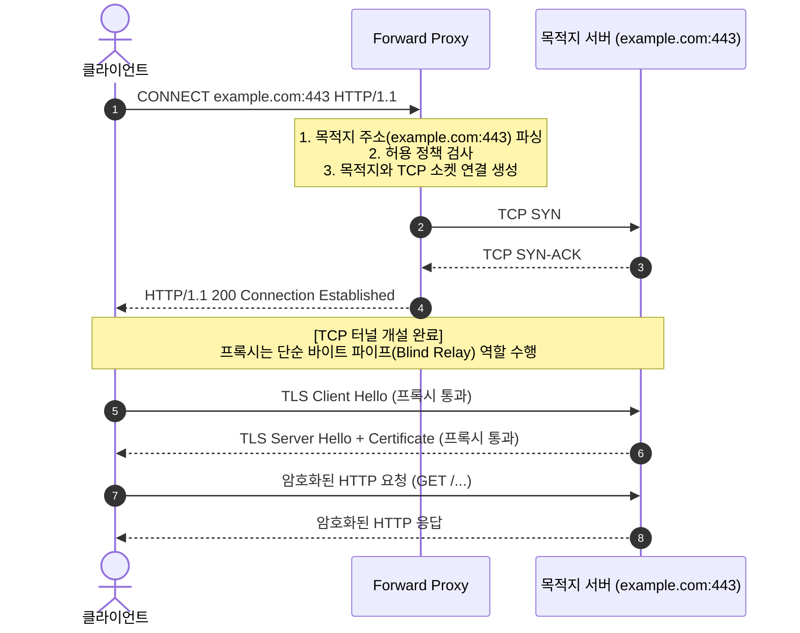

# Forward Proxy 개념 및 동작 원리

이 문서는 **Forward Proxy(포워드 프록시)**의 기본 개념, 내부 동작 원리, Reverse Proxy와의 차이점을 정리한 학습 문서입니다.

---

## 1. Forward Proxy란?

**Forward Proxy**는 클라이언트(내부망 사용자, 브라우저, 애플리케이션 등)와 외부 인터넷(목적지 서버) 사이에 위치하여 **클라이언트를 대신해 외부 서버에 요청을 전달하고 응답을 받아오는 중계 서버**입니다.

### 주요 특징
- **클라이언트 대변**: 요청의 실제 발신자는 클라이언트이지만, 목적지 서버는 프록시 서버의 IP를 보게 됩니다.
- **클라이언트 인지 여부**: 클라이언트는 프록시 서버의 존재를 명확히 알고 있으며, OS나 애플리케이션에 프록시 주소(`IP:PORT`)를 명시적으로 설정합니다.

### 주요 활용 목적
1. **보안 및 접근 제어 (Access Control / Filtering)**
   - 사내망에서 유해 사이트나 특정 도메인(예: 비업무 사이트, 악성코드 배포지)으로의 접속을 차단.
   - 특정 IP 대역만 외부 접속을 허용하는 화이트리스트 정책 적용.
2. **익명성 및 IP 은닉 (Anonymity)**
   - 목적지 서버에게 클라이언트의 실제 IP 주소를 감춤.
3. **캐싱 및 대역폭 절약 (Caching)**
   - 동일한 외부 리소스에 대한 반복 요청을 프록시가 로컬에 저장해 두고 재사용하여 외부 네트워크 트래픽 절약 및 응답 속도 향상.
4. **로깅 및 감사 (Auditing & Monitoring)**
   - 내부 사용자가 언제, 어떤 외부 사이트에 접속했는지 모니터링 및 기록.

---

## 2. Forward Proxy vs Reverse Proxy

| 비교 항목 | Forward Proxy | Reverse Proxy |
| :--- | :--- | :--- |
| **대변 대상** | **클라이언트(Client)** | **서버(Origin Server)** |
| **위치** | 클라이언트 측 네트워크(내부망, 사내망) | 서버 측 네트워크(DMZ, 서버 팜 앞단) |
| **클라이언트 인지** | 클라이언트가 프록시 설정(IP/Port)을 직접 함 | 클라이언트는 일반 웹 서버에 접속하는 줄 앎 |
| **서버 인지** | 서버는 프록시 IP만 알 수 있음 (X-Forwarded-For 없을 시) | 서버는 프록시를 통해 요청을 받음 |
| **핵심 목적** | 사내 보안 정책, 외부 접근 차단, 클라이언트 익명성 | 로드 밸런싱, SSL 종단(Termination), 서버 보호(DDoS 방어), 웹 가속 |

```
[ Forward Proxy 구조 ]
[클라이언트들] ───> [Forward Proxy] ─── (인터넷) ───> [외부 웹서버들]
  (사내망/내부망)

[ Reverse Proxy 구조 ]
[불특정 다수 클라이언트] ─── (인터넷) ───> [Reverse Proxy] ───> [내부 백엔드 서버들]
                                             (서비스 인프라망)
```

---

## 2.1 Forward Proxy vs NAT(공유기) vs 공인 IP

Forward Proxy를 처음 접할 때 **"사설 IP가 외부로 나갈 때 하나의 IP로 바뀐다"**는 점 때문에 **공인 IP**나 **NAT(Network Address Translation)**와 혼동하기 쉽습니다. 하지만 동작 계층과 원리가 완전히 다릅니다.

### 핵심 차이점 비교

| 비교 항목 | 공인 IP (Public IP) | NAT (네트워크 주소 변환) | Forward Proxy (포워드 프록시) |
| :--- | :--- | :--- | :--- |
| **개념** | 인터넷에서 유일한 **네트워크 주소** 그 자체 | 패킷의 IP/Port를 변환하는 **네트워크 기술/장비** | 요청을 중계 및 제어하는 **애플리케이션(소프트웨어)** |
| **작동 계층** | L3 (네트워크 주소) | L3 (IP) ~ L4 (Port) | **L7 (애플리케이션: HTTP/HTTPS)** |
| **TCP 연결** | - | 클라이언트 ↔ 서버 간 **단일 1:1 연결 (End-to-End)** | 클라이언트 ↔ 프록시 ↔ 서버 **2개 분리 연결** |
| **클라이언트 인지**| - | **모름 (투명하게 자동 변환)** | **알고 설정함 (브라우저/OS 프록시 등록)** |
| **URL/도메인 차단**| 불가 | **불가 (도메인이 뭔지 모름)** | **가능 (URL, 도메인, 헤더 기반 차단/허용)** |
| **캐싱 / 인증** | 불가 | 불가 | **가능 (중복 다운로드 캐싱, 프록시 인증)** |

### TCP 연결 구조의 차이
```text
[ NAT 방식 ] : 하나의 연결을 주소만 바꿔서 통과시킴
클라이언트 ══════════════ (NAT: IP 주소만 수정) ══════════════> 외부 서버
          └───────────── 하나의 TCP 연결 (End-to-End) ─────────────┘

[ Forward Proxy 방식 ] : 두 개의 완전히 독립된 연결
클라이언트 ────── TCP 연결 1 ──────> [Forward Proxy] ────── TCP 연결 2 ──────> 외부 서버
```

### 이해를 돕는 직관적 비유
* **공인 IP**: **"회사의 대표 전화번호"** (주소 그 자체)
* **NAT (공유기)**: **"사내 내선 교환기"** (내선 101번이 전화 걸면 대표번호로 발신 번호만 기계적으로 바꿔줌)
* **Forward Proxy**: **"회사의 전담 비서"** (직원이 "구글에서 자료 좀 받아와 달라"고 하면 내용과 보안 정책을 확인한 후, 비서의 이름/번호로 대신 요청하여 결과를 전해줌)

---

## 3. 세부 동작 원리

Forward Proxy는 프로토콜(HTTP vs HTTPS)에 따라 동작 방식이 근본적으로 다릅니다.

### 3.1 HTTP 요청 처리 (Absolute URI 방식)

일반 HTTP 요청의 경우, 프록시가 요청과 응답의 패킷(헤더와 바디)을 직접 읽고 가공할 수 있습니다.

#### 요청 라인의 차이
- **일반 HTTP 요청**: 상대 경로(Relative URI) 사용
  ```http
  GET /index.html HTTP/1.1
  Host: example.com
  ```
- **Forward Proxy HTTP 요청**: 절대 경로(Absolute URI) 사용
  ```http
  GET http://example.com/index.html HTTP/1.1
  Host: example.com
  ```

#### 동작 시퀀스


#### Hop-by-hop 헤더 처리
프록시는 클라이언트와 맺은 1차 연결과 서버와 맺는 2차 연결을 분리하므로, 특정 연결에 종속적인 헤더(Hop-by-hop Headers: `Connection`, `Keep-Alive`, `Proxy-Authenticate`, `Proxy-Authorization` 등)를 목적지 서버에 전달하기 전에 정제(제거)해야 합니다.

---

### 3.2 HTTPS 요청 처리 (HTTP `CONNECT` 터널링)

HTTPS는 클라이언트와 목적지 서버 간의 종단간 암호화(End-to-End Encryption)를 기본으로 합니다. 
따라서 프록시는 클라이언트가 보낸 데이터 내용을 알 수 없으며, 단지 **TCP 바이트를 양방향으로 중계하는 터널(Tunnel)** 역할만 수행합니다.

이때 사용되는 표준 HTTP 메서드가 바로 `CONNECT`입니다.

#### 동작 시퀀스


1. 클라이언트는 프록시에게 `CONNECT example.com:443 HTTP/1.1` 요청을 보냅니다.
2. 프록시는 목적지 서버의 443 포트로 직접 TCP 연결(`net.connect` 등)을 맺습니다.
3. 연결이 성립되면 프록시는 클라이언트에게 `HTTP/1.1 200 Connection Established`를 응답합니다.
4. 이후 클라이언트와 목적지 서버 간의 모든 데이터(TLS 핸드셰이크, 암호화된 HTTP 메시지)를 프록시는 양방향 소켓 파이프로 그대로 전달(`pipe`)만 합니다.

---

## 4. 심화 개념 (참고)

### 4.1 SSL Bump / MITM (Man-in-the-Middle) 프록시
- 원칙적으로 `CONNECT` 터널링 상태에서는 프록시가 HTTPS 패킷 내용을 볼 수 없습니다.
- 하지만 보안 점검(DLP, 악성코드 탐지)을 위해 기업 사내망에서는 **SSL Inspection(SSL 가시성)** 솔루션을 적용합니다.
- 동작 원리:
  1. 클라이언트 PC에 회사의 사설 인증 기관(Private CA) 루트 인증서를 강제로 설치합니다.
  2. 프록시가 클라이언트와 대신 TLS 핸드셰이크를 맺고(가짜 인증서 동적 생성), 목적지 서버와도 별도로 TLS 핸드셰이크를 맺습니다.
  3. 이를 통해 프록시 내부에서 트래픽을 복호화하여 패킷 검사를 수행합니다.

### 4.2 프록시 인증 (Proxy Authentication)
- 허가된 사용자만 프록시를 통과시키기 위해 사용됩니다.
- 상태 코드: `407 Proxy Authentication Required`
- 헤더: `Proxy-Authenticate`, `Proxy-Authorization`
